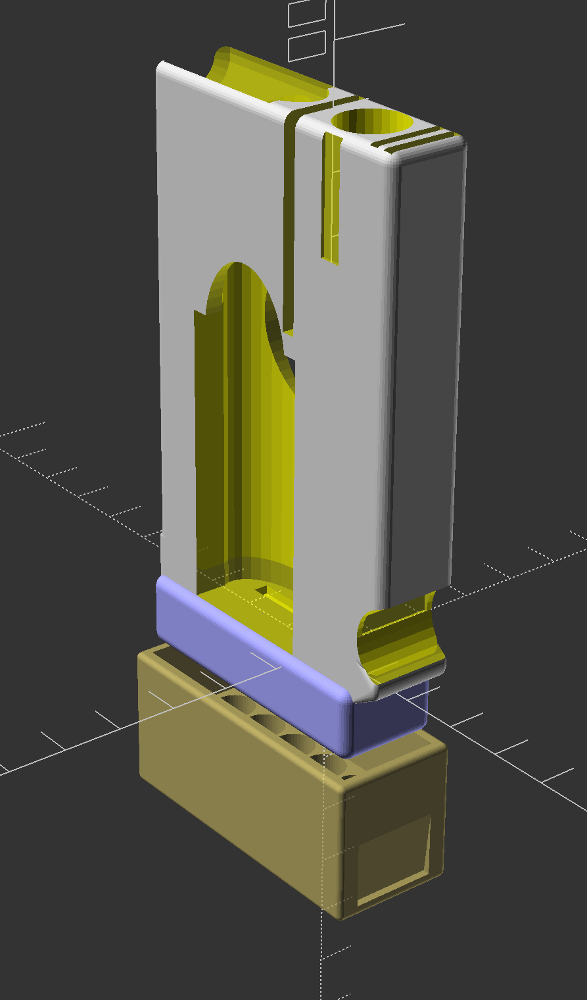
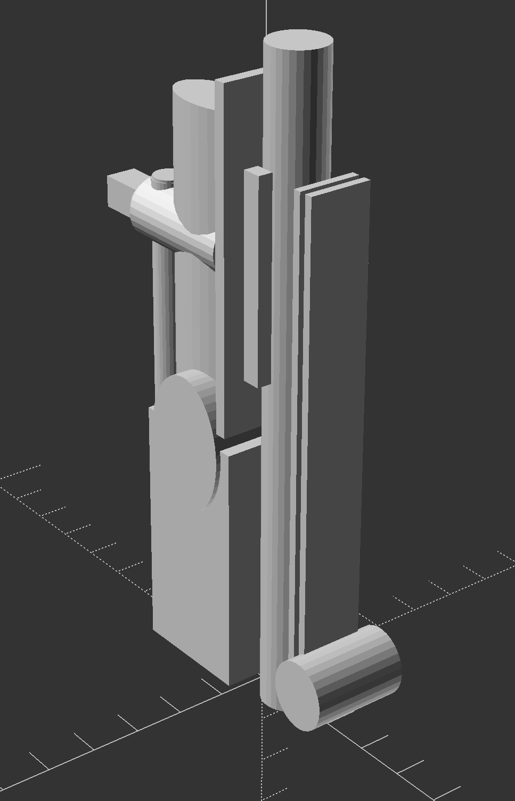

# Everyday-Carry (EDC) tool organizer

## What is it for?

Everyone has a set of things they take with them.
Usually these things fit into a pocket, purse, or small bag.
Most of the time, it means a phone and perhaps a wallet, but people carry many things. Some folks carry tools, either because they expect to undertake  certain tasks with no notice, or because it's nice to be useful.
I have a certain set of tools that I carry, and most of them are small.
Any pouch I used to hold them would either unload all of the tools as I tried to locate *that one tool I needed*, or else the pouch was an organizer that traded efficiency and size for weight, bulk, and organization.
I ended up making a small organizer that seems to work very well.
Naturally you don't have this exact set of tools, but if you face similar tasks, you will likely have similar tools. Regardless, that's the joy of open-source software: you can make it just the way you like it.

The doodad I made holds a set of hex bits, another set of hex bits, a small hex driver, a small multi-bit screwdriver, some zip ties, a small pry-bar-and-bottle-opener tool, and it allows a binder clip to attach to the outside.

| Rendering of the organizer | The shape of all the tools, used to create the storage spaces in and on the organizer |
| --- | --- |
|  |  |

## The Code

This model is built with OpenSCAD, an open-source 3D CAD modeling language that has syntax akin to that used in C and MatLab.
While I include the STL for this model, most of the OpenSCAD code is straightforward.
You are free to modify the code for your own purposes.

Jesse Hamner, 2021

