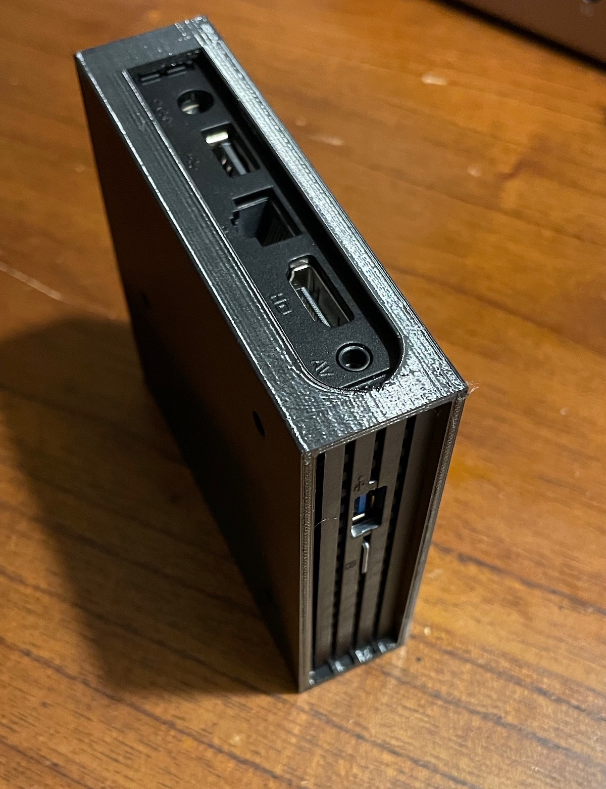
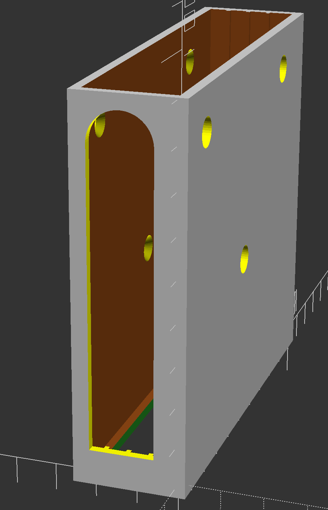
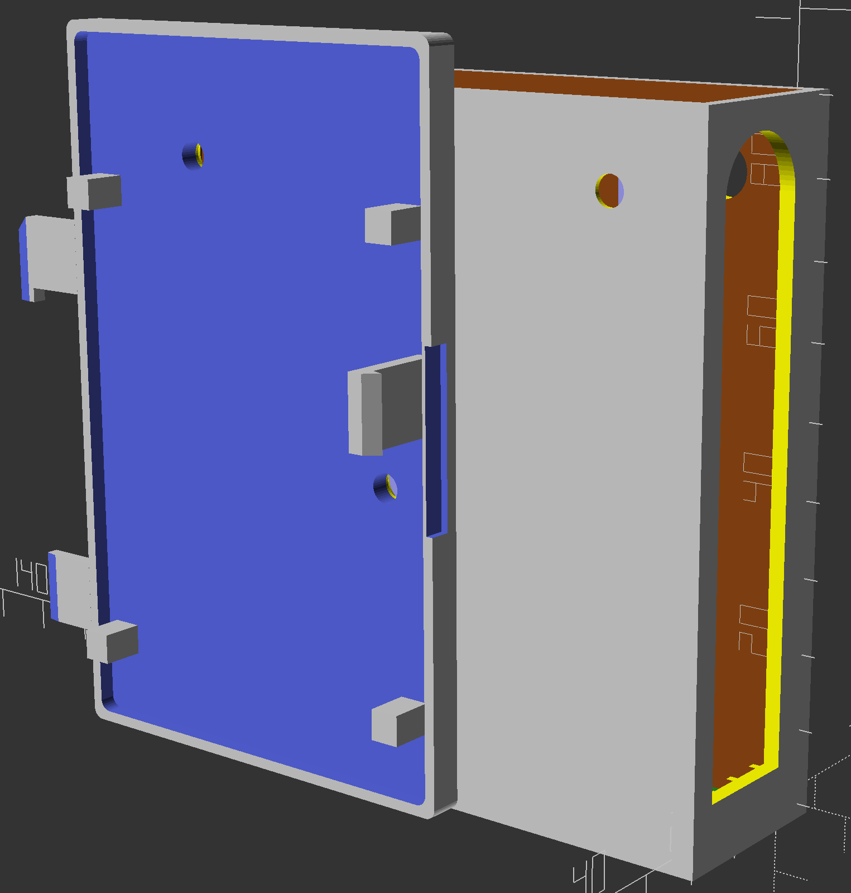
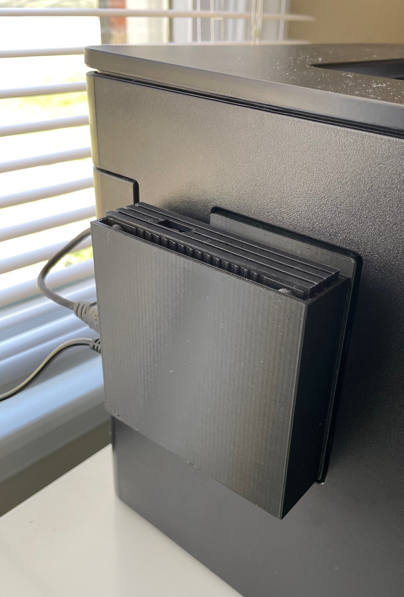
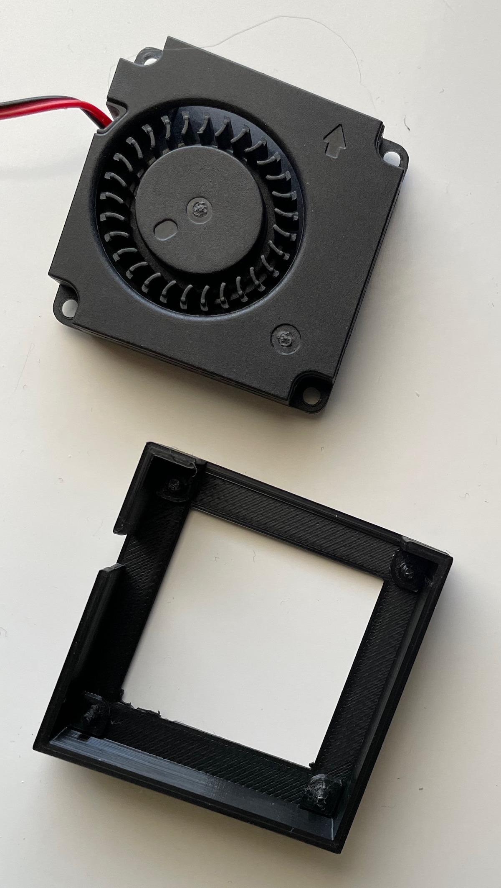
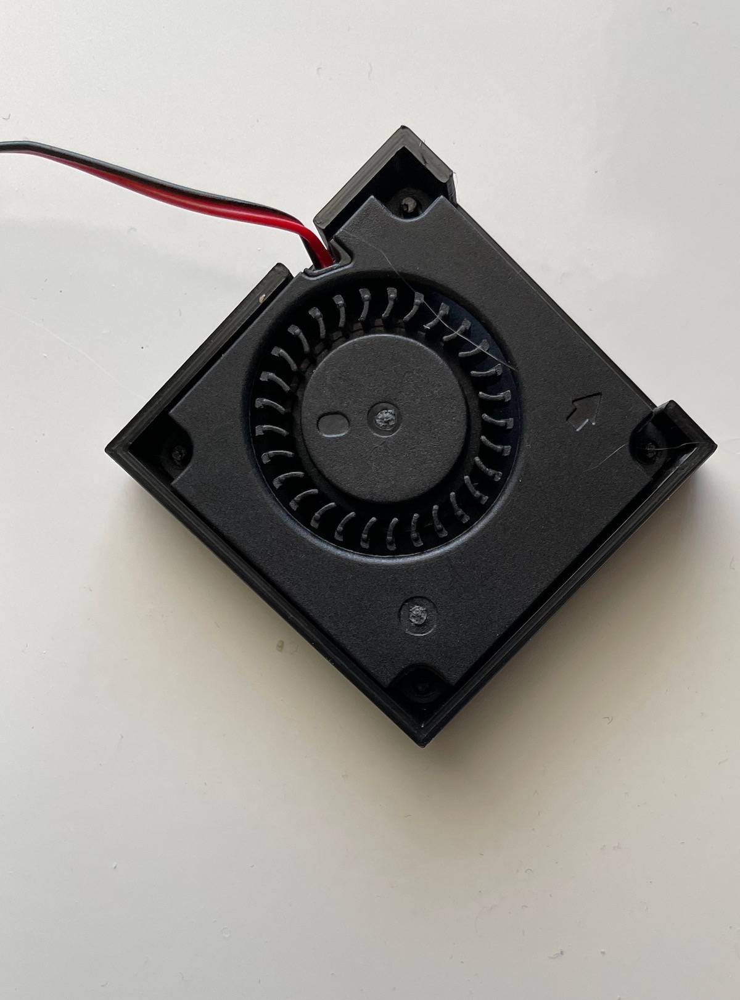
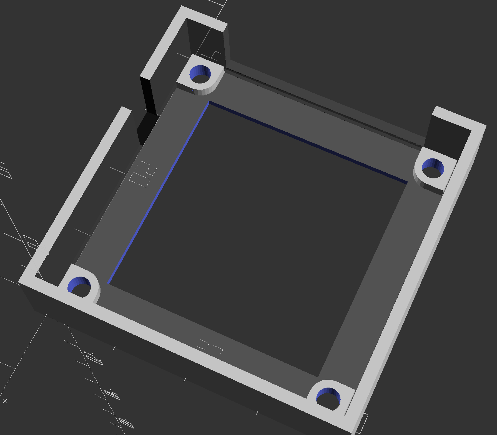
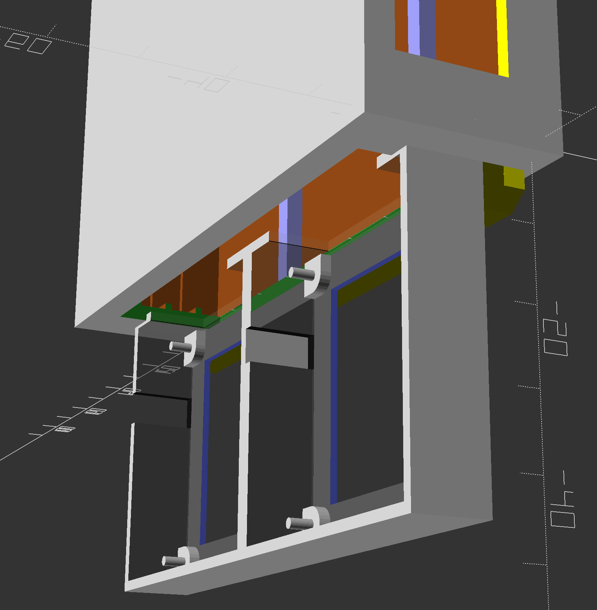

# Inovato TV Set-top-box 3D case

## Introduction

Somewhere I have at least one example from every generation and form factor of Raspberry Pi.
But as you've probably noticed, they've been scarce for the past three years.
There are other options than the Raspberry Pi ecosystem, and I learned about the [Inovato Quadra](https://www.inovato.com/) from a ham radio resource. 
The source being a ham radio site suggests a generally good product and experience.
Hams are typically frugal, technical, and practical. 
I had a good feeling about the $35 ARM set-top box.
It runs hot, it has limited RAM, and it's not very capable, but you don't buy this as a desktop replacement.
It's suited to one low-performance task at a time, and that's just fine.
I run my 3D printer with OctoPrint on a Raspberry Pi 3, and I have no complaints.
I have an [HP LaserJet 400 m401dne](https://www.hp.com/us-en/shop/pdp/hp-laserjet-pro-400-printer-m401dne)
that supports wired network printing but has no wireless interface, and even if it did, it does not natively support
Apple's AirPrint functionality. But [Debian Linux supports Bonjour](https://wiki.debian.org/CUPSAirPrint) (with the `avahi-daemon` and [Multicast DNS](https://en.wikipedia.org/wiki/Multicast_DNS)).
So even though the Inovato CPU doesn't have much horsepower, it can function nicely as a wireless, iOS-friendly printer server.

### The Basic Enclosure

The OpenSCAD code allows for the mount holes to be set for either side (one side will have larger holes for the screwdriver, and the other will have chamfered holes for the threaded fasteners).

| Basic enclosure | |
| --- | --- |
|  A completed case with the set-top box inserted. |  Rendering showing the chamfered mount holes. |

## Why the Printer Door?

The printer has an access door for the formatter board (main/motherboard for the printer).
The door is part number RC3-2547 P1-3. Like most printer hulls, it's made from ABS plastic. 
The door is quite close to the rear panel where the Ethernet and USB ports are (this makes sense: they're part of the formatter board).
So the door is an ideal location for the Inovato to live. I measured and copied the door, then incorporated the door into my open-top slot case design.
I'm very pleased with the results, and the Inovato box weighs little, so PLA is fine. No need to print with ABS filament, or even PETG.

| Rendering of the case | Case installed in the printer |
| --- | --- | 
|  This image includes holes for fasteners, but the case can just be printed as a single unit. |  For the final version of this specific design, I 3D printed the unit as a single object. |

## Fans

Several other Inovato Quadra cases that include forced-air cooling place a fan perpendicular to the bottom of the case, because that's how the air flows from most PC case fans.
But there are smaller fans that exhaust along the long axis instead of perpendicular to it.
So I bought two "Wathai" branded 5V brushless 40mm fans online and designed a frame to hold one, that could be included in a project if desired.
While the fans are not powerful, they can sit flush against the surface upon which the Quadra is mounted, and thus provide more options for mounting
and also guaranteeing that the air intakes will not be blocked.

| Fan with example socket | Fan pressed into the example socket |
| --- | --- | 
|  |  This version of the socket does not use fasteners, but creates a friction fit with small posts. Naturally CA glue or epoxy could be used for a permanent bond, if the fan vibrates or loosens. |

The OpenSCAD model also allows for through-hole sockets, for traditional threaded fasteners. Similarly, I'm working on a two-fan add-on that would attach with machine screws and nuts, because it would be awkward to print a complete case with the two fan sockets hanging off the bottom. Powering the fans would probably mean soldering a JST splitter onto the 5V power jack inside the case, but that's a topic for another day.

| Fan socket with through holes | Twin-fan cooler rendering |
| --- | --- | 
|  |  |

## Configuration Tips if You Are Building a Wireless Print Server

Configuring CUPS and all the `avahi` components is beyond the scope of a 3D printed case README file.
That said, specific to the Armbian / Inovato Quadra experience, I learned the following helpful hints:

- Ensure that all users have permissions to use the wireless connection, not merely your default user.
Otherwise you can't log in remotely.
Use `nmcli con modify` (the wireless connection information should be in `/etc/NetworkManager/system-connections` )
and change the `connection.permissions` to `''`
- Ensure that ssh remote logins work
- Install `hplip`, `hplip-data`, `hpijs-ppds`, `hplip-doc`, and possibly `hplip-gui`
- Confirm that your default user is part of the `lpadmin` group
- Stop the GUI with `systemctl stop lightdm.service`
- Disable the GUI with `sysctl disable lightdm` because the GUI is a heavy load on the CPU and GPU and isn't needed for a print server (the server offers a simple webpage at `its_IP_address:631` )
- There's a very good walkthrough for setting up a print server at [LinuxBabe.com](https://www.linuxbabe.com/ubuntu/set-up-cups-print-server-ubuntu-bonjour-ipp-samba-airprint)

## For more:

- [Inovato website](https://www.inovato.com/)
- [Inovato forums](https://forum.inovato.com/)
- [Inovato stands and 3D printable cases](https://forum.inovato.com/stands-cases-919769)

Jesse Hamner, 2023
