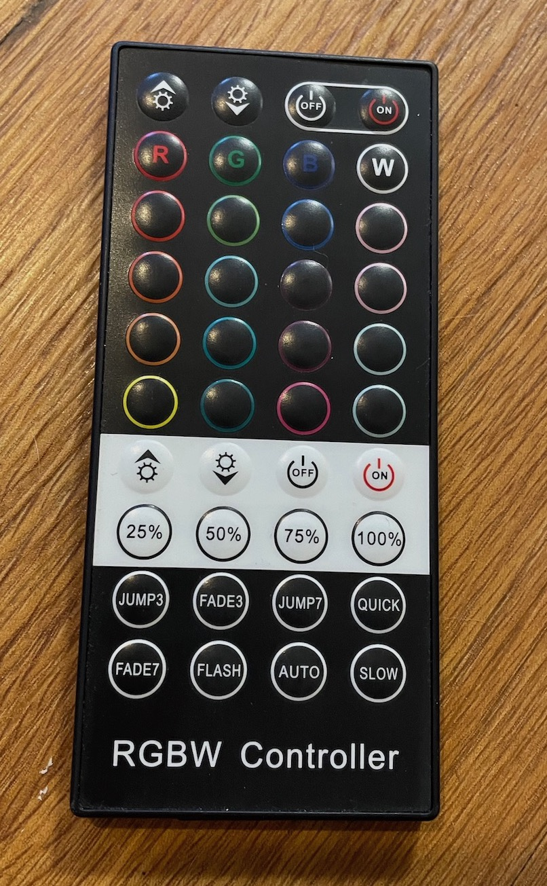
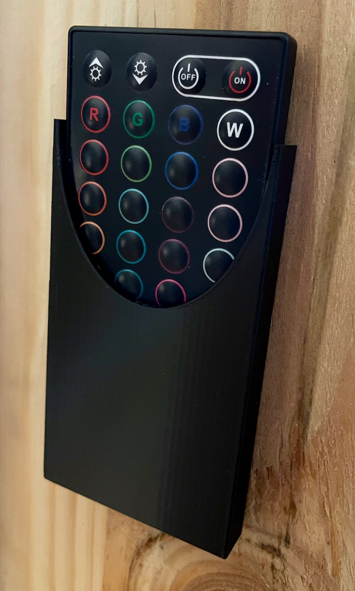

# Simple LED strip remote holder

## What is it for?

This model is a very simple wall-mountable holder for a fairly standard remote control, used with multi-color LED strips.
The LED strips I have all run on 12VDC.

| Example remote control | Installed on my 3D printer enclosure |
| --- | --- |
|  |  |

## The Code

This model is built with OpenSCAD, an open-source 3D CAD modeling language that has syntax akin to that used in C and MatLab.
While I include the STL for this model, the CAD design is very simple.
Unless you have this *exact* remote, you may be better off tinkering with OpenSCAD to make a wall-mountable enclosure for some handheld rectangular thing.

Jesse Hamner, 2022

