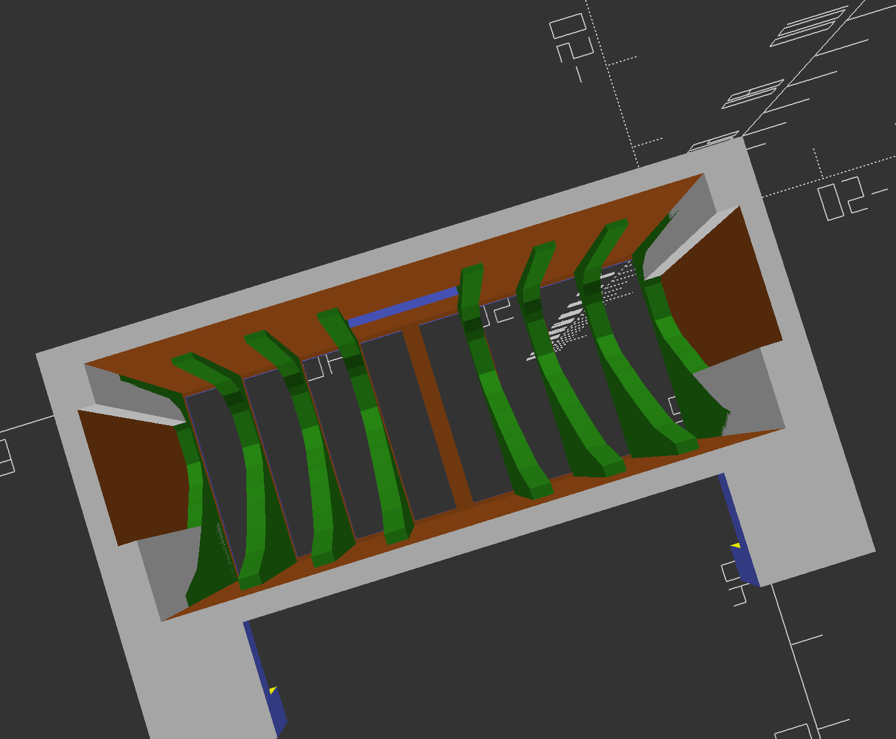

# Magic Mouse 2 Charging Pocket 

## What is it for?

Apple's Magic Mouse 2 is nice enough, but the charge port location is a pain. I never liked having the mouse upside down on the desk, so I made a hanging box with a port for the Lightning cable. However, making a simple rectangular box is easy -- then you try to plug in the cable and the mouse slips around inside the box. So it becomes useful to generate some profiles of various slices along the mouse to hold the entire device in one place. This process took longer than I expected, but the results are great.

The box hooks are made to hang on a hutch made by [j5create](https://en.j5create.com/) that includes a USB hub.
The stand is the [JCT425](https://en.j5create.com/collections/monitor-stands/products/jct425), though other monitor stands may use the same size slot for the USB hubs.
It's nice enough, though the USB hub is a bit flaky.
Because the USB hub can mount to either side but not both, one side always has an open "mail slot".
So I use this slot as the hanger support for these two boxes.

| Rendering of one hanging box | Two boxes in use |
| --- | --- |
|  |  |

## The Code

This model is built with OpenSCAD, an open-source 3D CAD modeling language that has syntax akin to that used in C and MatLab.
While I include the STL for this model, most of the OpenSCAD code is straightforward.
The profile code for the mouse is a bit odd, but that was necessary.
If you want a hanging box without the custom-fit ribs for the mouse, there's an STL of the box. The code has a provision to make a model without those profile ribs if you want. 
You are free to modify the code for your own purposes.

Jesse Hamner, 2022

