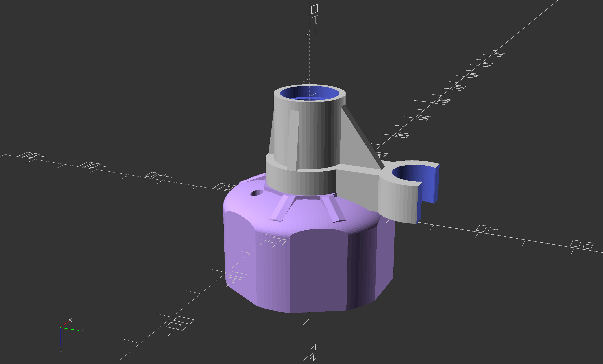
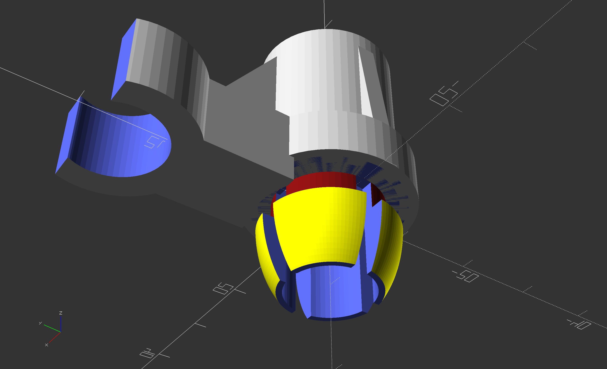

# Zefal HP "Husky" Bicycle Pump Replacement Cap

## What is it for?

The Zefal HP bicycle pump (apparently made by a German company, rather than Zefal) has a cast iron base and can pressurize tires up to 200 psi. It was a good deal in the 1990s when I bought it. I use it fairly regularly for bike tires and car tires. Finally the ABS cap and piston rod guide broke. There are no replacements available. But it wasn't that much work to copy the design in OpenSCAD.

I found that the original two-piece design wasn't well suited for PLA or PETG, and the barbs that held the rod guide in place snapped off without much effort. Rather than try to improve the design, I integrated both pieces into a single unit. It works very well.

| Rendering of the Single Unit | The Discrete Barb Connector That Didn't Work |
| --- | --- |
|  |  |

## The Code

This model is built with OpenSCAD, an open-source 3D CAD modeling language that has syntax akin to that used in C and MatLab.
While I include the STL for this model, the CAD design is simple, and contained in two files. 
You are free to modify the code for your own purposes.

Jesse Hamner, 2022

